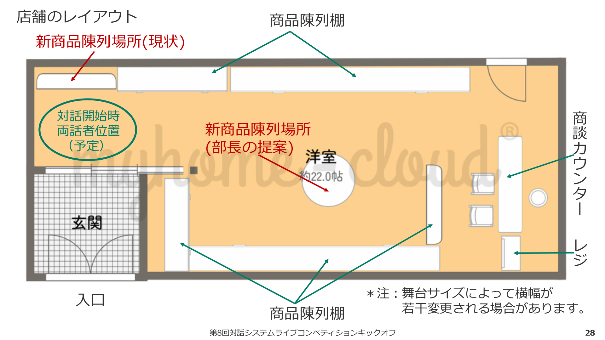
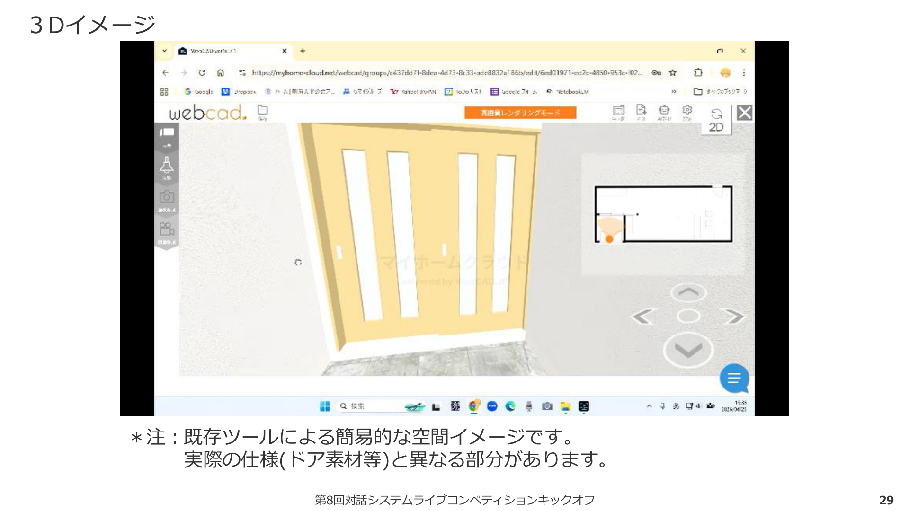
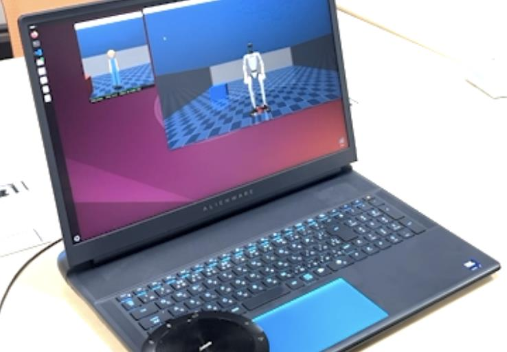
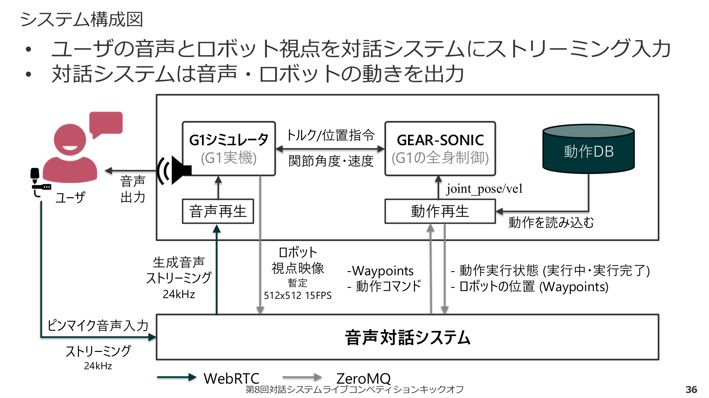
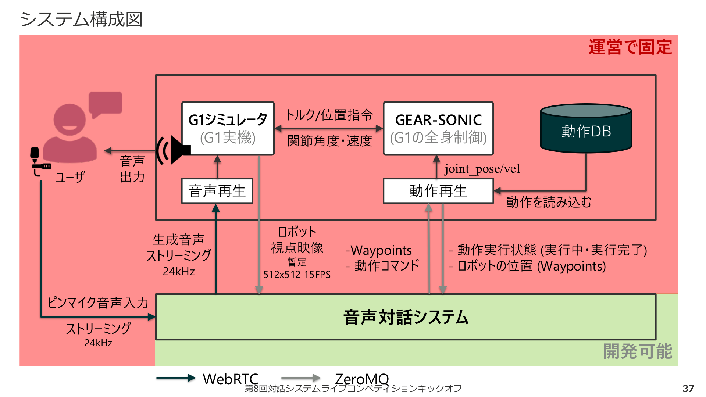
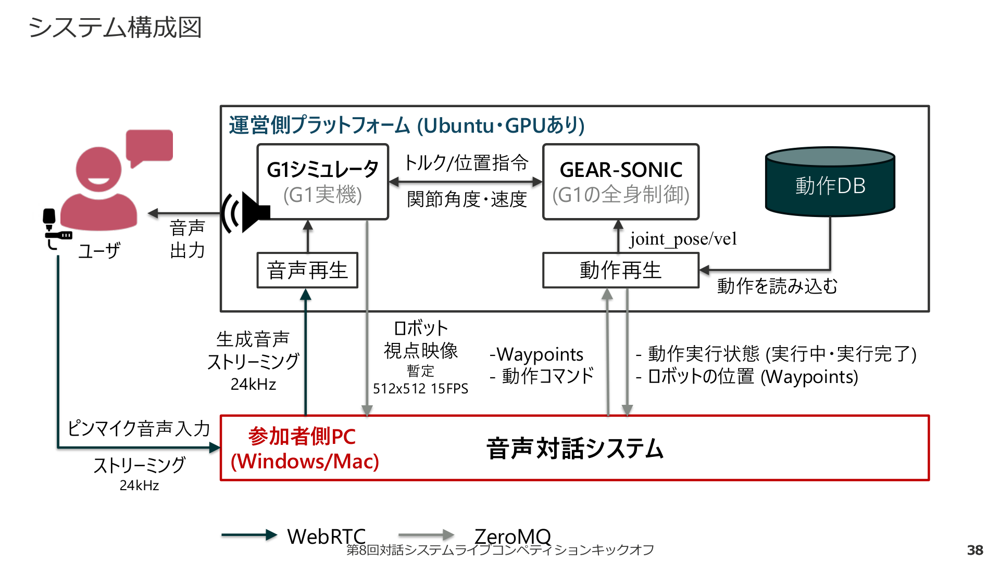
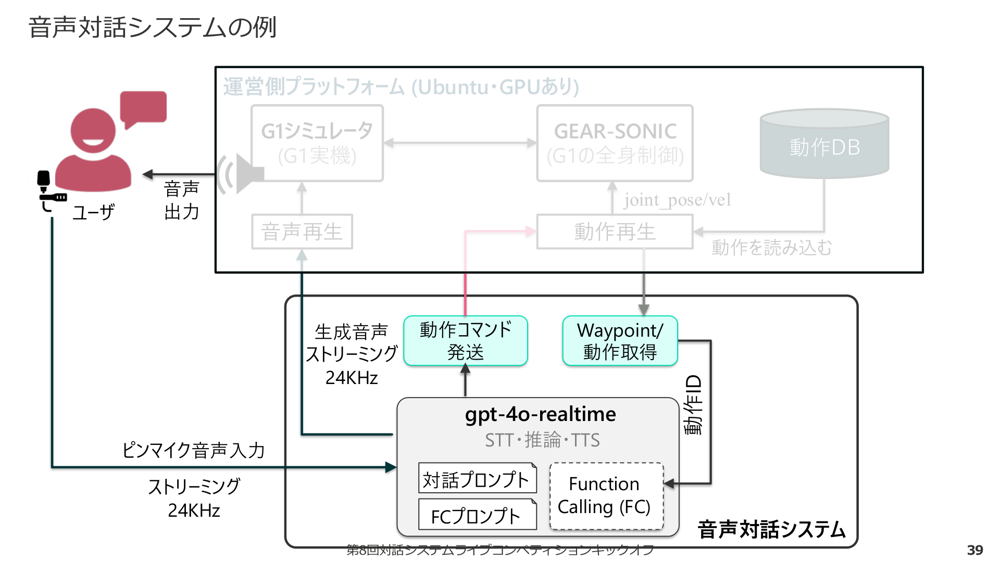
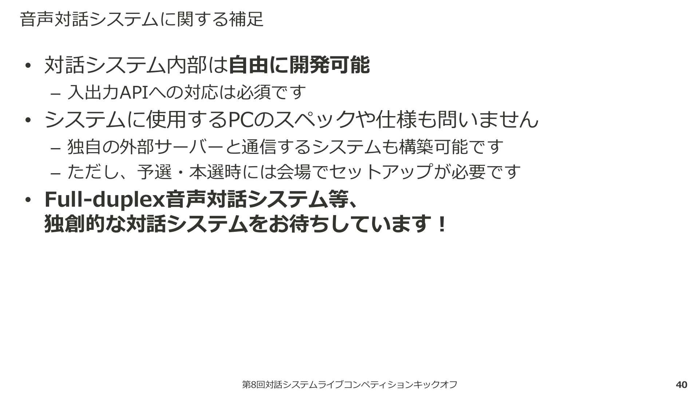
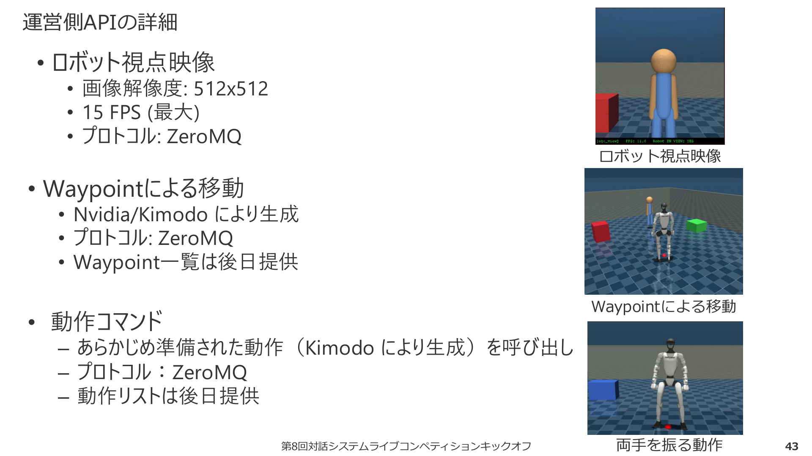

# How-to ガイド — 第8回対話システムライブコンペティション (DSLC8)

> **対象読者:** コンペティション参加者  
> **ベースリポジトリ:** `mobile-robot-dialogue-system`  
> **最終更新:** 2026-06-25

---

## 目次

1. [コンペティション概要](#1-コンペティション概要)
2. [シチュエーション設定](#2-シチュエーション設定)
3. [店舗レイアウト（図解）](#3-店舗レイアウト図解)
4. [評価ポイント](#4-評価ポイント)
5. [システムアーキテクチャ全体像（公式図解）](#5-システムアーキテクチャ全体像公式図解)
6. [開発環境・条件の詳細](#6-開発環境条件の詳細)
7. [運営側APIの詳細（公式図解）](#7-運営側apiの詳細公式図解)
8. [現状のプログラムで「できること」](#8-現状のプログラムでできること)
9. [現状のプログラムで「できないこと・課題」](#9-現状のプログラムでできないこと課題)
10. [セットアップ手順クイックガイド](#10-セットアップ手順クイックガイド)
11. [起動・停止フロー](#11-起動停止フロー)
12. [ディレクトリ構成マップ](#12-ディレクトリ構成マップ)
13. [質問集 (Q&A) まとめ](#13-質問集-qa-まとめ)
14. [今後の開発方針](#14-今後の開発方針)

---

## 1. コンペティション概要

| 項目 | 内容 |
|------|------|
| **正式名称** | 第8回対話システムライブコンペティション (DSLC8) |
| **主催** | ライブコンペ8 オーガナイザ |
| **開催形式** | 予選 + ライブイベント（本選） |
| **テーマ** | ヒューマノイドロボット (Unitree G1) を用いたマルチモーダル対話システム |
| **前回との最大の違い** | CGエージェント → **実体のあるヒューマノイドロボット**へフロントエンドが変更 |
| **予選方式** | MuJoCo Simulator 上でのシミュレーション対話 |
| **本選方式** | 実際の G1 ヒューマノイドを用いた対面対話 |
| **全体最長時間** | 約90分程度を予定 |

> 大勢の観衆の前でライブで対話システムを動作させ評価するイベント。
> 最先端のシステムの到達点・課題点をコミュニティで共有する。


### スケジュール（確定分）

| 日付 | イベント |
|------|---------|
| 2026/04/18 | キックオフ |
| 2026/05/20 | エントリ済み参加者へ正式版ソフトウェア配布 |
| 2026/08/01 | エントリ締切（HPからエントリ可能） |
| 2026/09/01 | システム開発締切 |
| 2026/09/12 | 予選開催 |
| 2026/10/01 | 予選結果通知 |
| 2026/10-11月 | 論文提出・本選準備 |
| 2026/11/14 | ライブイベント（対話システムシンポジウム内・早稲田大学） |

### レギュレーション要点

- **開発環境は各自で準備**（予選・本選時も自身のマシンで実行）
- 基本は**自身のマシン**で実行。難しい場合は運営に相談
- 参加チームは以下を入出力可能なプログラムおよびマシンを用意：
  - **入力:** ロボット視点カメラ映像・対話者音声・ロボット状態
  - **出力:** ロボット音声・ロボット位置・ロボット動作
- **プログラミング言語の指定はなし**（自由）
- 独自の外部サーバーと通信するシステムも構築可能
- ただし、**予選・本選時には会場でセットアップが必要**
- エントリすると原則予選参加が必須
- 予選に先立ち、最低限の対話や制御が可能かを確認する**スクリーニングを実施**する可能性あり（スクリーニングを通過しなかったシステムは評価対象外）
- 予選通過しなかったチームも発表可能（強く推奨）

### DSLC の歴史（ライブコンペ1〜8の変遷）

| 回 | 年 | 特徴 |
|----|-----|------|
| DSLC1 | 2018/11 | テキストのみ |
| DSLC2 | 2019/12 | 初期: テキスト対話（テキストチャットのみ想定） |
| DSLC3 | 2020/11 | テキストの入出力を扱う |
| DSLC4 | 2021/11 | 出力のマルチモーダル化 |
| DSLC5 | 2022/12 | 音声合成とモーションでマルチモーダル出力対応 |
| DSLC6 | 2023/12 | ユーザの顔画像も入力情報として利用可能に |
| DSLC7 | 2025/3 | 入出力ともにマルチモーダル化（CGエージェント） |
| **DSLC8** | **2026** | **ヒューマノイドロボットとの対話に拡張 ← 今回** |

---

## 2. シチュエーション設定

### 課題

> 上司の顔も立てつつ、部下である店員の意見を通せる、頼りがいのある中間管理職システム **「ロボット店長」** を開発してください。

### 登場人物と関係

| 役割 | 詳細 |
|------|------|
| **システム（あなたが開発）** | 携帯電話販売店の **ロボット店長** |
| **対話者（部長）** | この地域の複数店舗を管轄するエリアマネージャー。最近異動してきた方でほとんど面識なし |
| **関係性** | 対話者はシステムにとって **ほとんど面識のない上司** |
| **場所** | 携帯電話販売店舗 |
| **時間** | 閉店後 |

### 背景ストーリー

- この店舗は**独自のレイアウトの工夫**で売上を伸ばしてきた
- 部長は本日**初めてこの店舗を訪問**（図面しか見ていない）
- 部長は研修会で「**新商品は一番奥の通路に置くべきだ**」と聞き、その話を信じ切っている
- しかし、この店舗では外を通る客からは**入口正面しか見えず**、店の奥は**死角**
- 部長の提案を受け入れると集客は見込めない
- スタッフからも「**なんとか阻止してください**」と頼まれている
- **双方の顔を立てた対応**が求められる

> ⚠️ **重要:** 円滑なコミュニケーションが行われることを競うもので、**部長から承諾を得ることが競技ポイントではない。**

---

## 3. 店舗レイアウト（図解）

### 公式平面図（注釈付き）



**ポイント:**
- **入口（左下）** — 扉部分がガラス張り。外部から入口正面のみ店内が見える
- **新商品陳列場所（現状）** — 入口付近（外から見える好位置）← 赤文字で示される
- **新商品陳列場所（部長の提案）** — 店の中央奥（外から**死角**）← 緑文字で示される
- **商品陳列棚** — 壁沿い上下に配置
- **商談カウンター** — 右奥（テーブル + 椅子3脚）
- **レジ** — 右奥（商談カウンターの隣）
- **対話開始時の両話者位置（予定）** — 入口付近に緑の楕円で表示

### 3Dイメージ



> ※ 既存ツールによる簡易的な空間イメージです。実際の仕様（ドア素材等）と異なる部分があります。

### MuJoCo シミュレータ上の再現



> MuJoCo Simulator 上に再現された店舗環境。G1ロボットとユーザモデルが配置されている。

### MuJoCo シーン座標系

| 要素 | 位置・サイズ |
|------|-----------|
| **室内サイズ** | x ∈ [-2, 2] (幅4m)、y ∈ [-1, 9] (奥行10m) |
| **Robot 初期位置** | (0, 0, 0.793) |
| **User 初期位置** | (1.5, 0, 0.55) |
| **奥壁** | y = 9, 幅4m × 高1.5m |
| **入口壁** | y = −1, 幅4m × 高1.5m |
| **左壁** | x = 2 (y: 1〜9), 奥8m × 高1.5m |
| **右壁** | x = −2 (y: −1〜9), 奥10m × 高1.5m |
| **商品陳列棚（左壁沿い）** | x = 1.78, 奥側 y:6〜9 / 中央 y:1〜6 |
| **商品陳列棚（右壁沿い）** | x = −1.78, 同上 |
| **商談カウンター** | テーブル (-0.5, 7.8) + 椅子3脚 |
| **レジカウンター** | 本体 (0.65, 7.8) + 端末 (0.65, 7.45) |

### 移動可能グリッド

```
移動可能セル: x ∈ {-1, 0, 1}、y ∈ {0..6}  計 20 セル
  x = -1 : 右側通路
  x =  0 : 中央通路
  x =  1 : 左側通路
  y =  0 : 入口付近 (Robot 初期位置)
  y =  6 : 店内奥 (y=7,8 はカウンターエリアのため移動不可)
```

---

## 4. 評価ポイント

予選では以下の **4つ** が評価ポイント（詳細な評価項目は後日公開）:

| # | 評価項目 | 具体例 |
|---|---------|--------|
| 1 | **マルチモーダルなやりとり** | 相づち、ターンテイキング、動き |
| 2 | **対面ならではの話し方** | 空間の指示を指さしで行い、無理に言語化しない |
| 3 | **待遇表現等とジェスチャーのリンク** | あいさつに合わせたお辞儀、否定の手振り、「うーん」と首傾げ |
| 4 | **空間を適切に認識した動き** | 壁にぶつからない、部長の進路を妨げない、動きによる視線誘導 |

---

## 5. システムアーキテクチャ全体像（公式図解）

### 5.1 基本構成図

ユーザの音声とロボット視点を対話システムにストリーミング入力し、対話システムは音声・ロボットの動きを出力する。



### 5.2 運営で固定 vs 開発可能

赤色部分（G1シミュレータ + GEAR-SONIC + 動作DB等）は**運営側で固定**。
緑色部分（音声対話システム）が**参加者が自由に開発可能**な領域。



### 5.3 運営側PC・参加者側PCの分離

予選・本選時には、運営側プラットフォーム（Ubuntu・GPUあり）と参加者側PC（Windows/Mac可）が分離される。



### 5.4 音声対話システムの内部構造例

gpt-4o-realtime を中心に、STT・推論・TTS を一体化。
Function Calling (FC) で動作コマンド発送と Waypoint/動作取得を行う。



### 5.5 音声対話システムに関する補足



**要点:**
- 対話システム内部は**自由に開発可能**（入出力APIへの対応は必須）
- システムに使用するPCのスペックや仕様も問わない
- 独自の外部サーバーと通信するシステムも構築可能
- ただし予選・本選時には**会場でセットアップが必要**
- **Full-duplex音声対話システム等、独創的な対話システムをお待ちしています！**

---

## 6. 開発環境・条件の詳細

### 6.1 ハードウェア要件

| 項目 | 要件 |
|------|------|
| **OS** | **Ubuntu** が必須（基盤開発環境）。将来 Windows 対応の可能性あり |
| **GPU** | **RTX 4080 / 5080 相当以上** が必要 |
| **形態** | ノートPC・デスクトップPC・クラウド いずれも使用可能 |
| **TensorRT** | 指定バージョンの TAR パッケージが必須（約10GB）。異なるバージョンは危険動作の原因 |
| **Docker** | GR00T WBC の deploy 環境、Kimodo の text encoder に必要 |

### 6.2 通信プロトコルまとめ

| データ | 方向 | プロトコル | 仕様 |
|--------|------|-----------|------|
| ピンマイク音声入力 | ユーザ → 対話システム | WebRTC | ストリーミング 24kHz |
| 生成音声出力 | 対話システム → ユーザ | WebRTC | ストリーミング 24kHz |
| ロボット視点映像 | GEAR-SONIC → 対話システム | ZeroMQ | 512×512, 最大15FPS |
| Waypoints・動作コマンド | 対話システム → GEAR-SONIC | ZeroMQ | — |
| 動作実行状態・ロボット位置 | GEAR-SONIC → 対話システム | ZeroMQ | 実行中・実行完了 |

### 6.3 予選時 vs 本選時

| 項目 | 予選 | 本選 |
|------|------|------|
| 環境 | MuJoCo Simulator | G1 実機 |
| 転倒時 | やり直し（最大3回、減点あり） | **その時点で終了** |
| 安全対策 | — | ワイヤー等で上部支持 |
| 対話相手 | 募集した被験者 | 一般から募った対話者 |
| 実行形態 | シミュレータ上 | 対面実演 |

### 6.4 音声入出力（現在の開発版 vs 予選・本選時）

| 項目 | 現在の開発版 | 予選・本選時 |
|------|------------|------------|
| 音声入力 | PyAudio（同一PC前提） | **WebRTC**（運営側提供予定） |
| 音声出力 | PyAudio（同一PC前提） | **WebRTC**（運営側提供予定） |
| マイク | PC内蔵/外付け | 外付けまたはPC内蔵スピーカー・マイク |
| エコーキャンセル | なし | **運営側では行わない**（参加者側で対応が必要な可能性） |

> ⚠️ 次回アップデートで主催者側と参加者側のコードが明確に分離される見込み。

### 6.5 ソフトウェア依存関係

| コンポーネント | ライセンス | 備考 |
|--------------|-----------|------|
| GR00T-WholeBodyControl | Apache 2.0 | ロボット全身制御（deploy + MuJoCo sim） |
| Kimodo | Apache 2.0 | テキスト → モーション生成（拡散モデル） |
| Meta Llama 3 (8B) | Meta License | Kimodo の text encoder が内部使用。HuggingFace でライセンス同意必要 |
| OpenAI Realtime API | OpenAI利用規約 | gpt-4o-realtime-preview（API キー必要） |
| MuJoCo | Apache 2.0 | 物理シミュレーション |
| ZeroMQ | LGPL v3 | ロボット制御通信 |

---

## 7. 運営側APIの詳細（公式図解）



### ロボット視点映像
- 画像解像度: **512×512**
- **15 FPS**（最大）
- プロトコル: **ZeroMQ**

### Waypointによる移動
- Nvidia/Kimodo により生成
- プロトコル: **ZeroMQ**
- Waypoint一覧は後日提供

### 動作コマンド
- あらかじめ準備された動作（Kimodo により生成）を呼び出し
- プロトコル: **ZeroMQ**
- 動作リストは後日提供

---

## 8. 現状のプログラムで「できること」

### ✅ 8.1 MuJoCo シミュレーション環境の起動

- `run_sim.sh` でMuJoCoウィンドウを起動し、G1ロボットのシミュレーション環境を表示
- キーボードショートカットで操作可能（`9`=床に下ろす、`C`=カメラ切替、`P`=viewer等）
- User model の移動（矢印キー）・リセット（Home）も可能

### ✅ 8.2 GR00T WBC による全身制御 (Deploy)

- `run_deploy.sh` で Docker コンテナを起動し、GEAR-SONIC による全身制御を開始
- `Init Done` 表示後、ロボットが直立の ready 姿勢に遷移
- ZMQ (port 5556) 経由で pose / command / planner メッセージを受信して制御

### ✅ 8.3 OpenAI Realtime API による音声対話

- `run_dialogue.sh` → `g1_realtime_dialogue.py` を起動
- **gpt-4o-realtime-preview** モデルを使用
- VAD (Voice Activity Detection) モードとPTT (Push-to-Talk) モードの両方に対応
- 日本語での音声対話が可能
- マイク入力 48kHz → 24kHz ダウンサンプリング → API → 音声出力 24kHz → 48kHz アップサンプリング

### ✅ 8.4 事前生成モーション (39種類) の再生

- `data/motions/` に39種類の `.npz` モーションデータを格納
- 各モーション: `jp` (関節角度 float32[T,29])、`jv` (関節速度)、`bq` (体幹クォータニオン)
- OpenAI の **Function Calling** (`select_motion`) で会話文脈に合ったモーションをAIが自律選択
- `MotionPlayer` クラスが SONIC FPS (50fps) でチャンク送信

### ✅ 8.5 基本的な歩行コマンド

- Function Calling (`walk_command`) で前進/後退/左右旋回/停止を指示可能
- `WalkerController` クラスが planner モードを管理
- キーボード WASD 手動操作も可能

### ✅ 8.6 Kimodo によるモーション新規生成

- **事前バッチ生成:** `generate_motions.sh` → Docker text encoder → `.npz` 出力
- **リアルタイム生成:** `run_realtime_motion_test.sh` でプロンプトを入力して即時再生
- 生成品質は `--steps` パラメータで制御（50=速度優先、100=高品質）

### ✅ 8.7 グリッドナビゲーション（単独テスト）

- `g1_move_test.py` で1mグリッド上のセル間移動が可能
- `go x y [facing]`、`walk N`、`face dir`、`mps` キャリブレーション等

### ✅ 8.8 カメラ映像ビューア

- `run_viewer.sh` で ego_view カメラ映像をウィンドウ表示
- `mujoco_viewer.py` が ZMQ 経由でフレーム受信・表示

### ✅ 8.9 パッチ管理システム

- `patches/` ディレクトリから `extern/` へシンボリックリンクで変更適用
- `.py`/`.yaml` は即時反映、`.xml`/`.sh` はコピー方式（再適用が必要）

---

## 9. 現状のプログラムで「できないこと・課題」

### ❌ 9.1 モーション・移動・対話の統合【最大の課題】

現状では各機能が分離されている：

| 機能 | ファイル | 統合状況 |
|------|---------|---------|
| 音声対話 + 事前モーション再生 | `g1_realtime_dialogue.py` | ✅ 統合済み |
| リアルタイムモーション生成 | `g1_realtime_motion_test.py` | ❌ 単独テスト用 |
| グリッドナビゲーション | `g1_move_test.py` | ❌ 単独テスト用 |
| WASD手動歩行 | `g1_simple_walk.py` | ❌ 単独テスト用 |

- `g1_realtime_motion_test.py` と `g1_move_test.py` は**同時実行不可**（ZMQポート競合）
- **参加者自身がこれらを `g1_realtime_dialogue.py` に統合する必要がある**

### ❌ 9.2 空間認識・環境理解

- ロボット視点カメラ映像は取得可能だが、**画像解析・認識機能は未実装**
- 対話者の位置や動きを認識する機能なし
- 「空間を適切に認識した動き」は評価項目だが、実装は参加者に委ねられている

### ❌ 9.3 WebRTC による音声通信

- 現在は PyAudio ベースの同一PC前提の実装
- 予選・本選時の WebRTC 通信は**運営から次回アップデートで提供予定**

### ❌ 9.4 シナリオ特化のプロンプト設計

- 現在の `SYSTEM_PROMPT` は汎用的な「G1ロボットのアシスタント」設定
- 「携帯電話販売店のロボット店長」としてのペルソナ未設定
- 部長との関係性、レイアウト問題の背景知識未組み込み

### ❌ 9.5 指さし・ジェスチャーの空間連動

- 特定の方向を指し示すモーションの動的生成は未実装
- ロボットの現在位置を考慮した指さし方向の計算なし

### ❌ 9.6 ターンテイキング・相づちの高度化

- 独自の VAP (Voice Activity Projection) 実装なし
- Full-duplex 対話への対応なし

### ❌ 9.7 エコーキャンセル・雑音処理

- 運営側ではエコーキャンセルを行わない旨が明示されている
- 参加者側で対策が必要

### ❌ 9.8 Windows 対応

- 現在の基盤はUbuntu前提
- シェルスクリプト（`.sh`）やキーボード制御（`termios`）が Linux 専用

### ❌ 9.9 転倒復帰・安全対策

- 転倒の検知やフェールセーフは未実装

---

## 10. セットアップ手順クイックガイド

### 前提条件

- Ubuntu 環境（+ GPU: RTX 4080/5080 相当以上）
- Docker がインストール済み
- Git LFS がインストール済み
- Meta Llama 3 の HuggingFace ライセンス同意済み

### Step 1: クローン

```bash
git clone <this-repo>
cd mobile-robot-dialogue-system
git submodule update --init --recursive
cd extern/GR00T-WholeBodyControl && git lfs pull && cd ../..
cd extern/kimodo && git clone https://github.com/nv-tlabs/kimodo-viser.git && cd ../..
cd extern/kimodo && docker compose build text-encoder && cd ../..
```

### Step 2: TensorRT + Deploy 環境

```bash
# TensorRT (TAR) をダウンロード → ~/TensorRT に配置
cd extern/GR00T-WholeBodyControl/gear_sonic_deploy
chmod +x scripts/install_deps.sh && ./scripts/install_deps.sh
source scripts/setup_env.sh && just build
```

### Step 3: MuJoCo Sim 環境

```bash
cd extern/GR00T-WholeBodyControl
bash install_scripts/install_mujoco_sim.sh   # → .venv_sim が作成される
```

### Step 4: パッチ適用 + 設定ファイル

```bash
bash scripts/patches/apply_patches.sh
cp configs/config.yaml configs/config.local.yaml
# config.local.yaml に OpenAI API キーを設定
```

### Step 5: モーションデータ生成（初回のみ）

```bash
bash scripts/motion/generate_motions.sh
```

---

## 11. 起動・停止フロー

### 起動（この順番で）

```
ターミナル1 → bash scripts/core/run_sim.sh          # MuJoCo 起動
ターミナル2 → bash scripts/core/run_deploy.sh        # Deploy (WBC) 起動 → "Init Done" を待つ
ターミナル3 → bash scripts/core/run_dialogue.sh      # 音声対話開始
```

### 停止（逆順で）

```
ターミナル3 → Ctrl+C
ターミナル2 → 'o' キー → EMERGENCY STOP → 自動シャットダウン
ターミナル1 → Ctrl+C
```

> ⚠️ Deploy (`run_deploy.sh`) は `Ctrl+C` ではなく必ず **`o` キー** で停止してください。

### MuJoCo キーボードショートカット

| キー | 動作 |
|------|------|
| `9` | 吊り上げ状態の G1 を床に下ろす |
| `Back` | 初期状態に戻す |
| `C` | カメラ切替（自由視点 → ego_view → user_eye → counter） |
| `P` | camera viewer ウィンドウ 開閉 |
| `]` | viewer 映像切替 (ego_view ↔ user_eye) |
| `Space` | user model の向きを 180° 切替 |
| 矢印キー | user model を移動 |
| `Home` | user model を Robot 前方にリセット |

### 対話時キーボード操作

| キー | 動作 |
|------|------|
| `W` | 前進 |
| `S` | 後退 |
| `A` | 左旋回 |
| `D` | 右旋回 |
| `Space` | 停止 |

---

## 12. ディレクトリ構成マップ

```
mobile-robot-dialogue-system/
├── extern/
│   ├── GR00T-WholeBodyControl/   # 全身制御 (deploy + MuJoCo sim) ← 直接編集禁止
│   └── kimodo/                   # モーション生成モデル ← 直接編集禁止
├── patches/
│   ├── gr00t/                    # GR00T へのパッチ (symlink方式)
│   └── kimodo/                   # Kimodo へのパッチ (symlink方式)
├── src/
│   ├── dialogue_system/
│   │   ├── g1_realtime_dialogue.py     # ★ メインエントリポイント
│   │   └── mujoco_viewer.py            # カメラ映像ビューア
│   ├── motion/
│   │   ├── generate_motions.py         # バッチモーション生成
│   │   ├── g1_motion_test.py           # モーション再生テスト (単独)
│   │   └── g1_realtime_motion_test.py  # リアルタイム生成テスト (単独)
│   └── move/
│       ├── g1_move_test.py             # グリッドナビゲーション (単独)
│       └── g1_simple_walk.py           # WASD 手動歩行 (単独)
├── scripts/
│   ├── core/         # run_sim.sh, run_deploy.sh, run_dialogue.sh, run_viewer.sh
│   ├── motion/       # generate_motions.sh, run_motion_test.sh, run_realtime_motion_test.sh
│   ├── move/         # run_move_test.sh, run_simple_walk.sh
│   └── patches/      # apply_patches.sh, remove_patches.sh
├── data/
│   └── motions/      # 生成済み .npz (39種類)
├── configs/
│   ├── config.yaml          # テンプレート
│   └── config.local.yaml    # 実際の設定（.gitignore対象）
├── docs/
│   ├── How-to.md            # ★ このファイル
│   ├── img/                 # 本ドキュメント用画像
│   └── reference/           # 公式配布資料（PDF, QAなど）
└── environments/             # 環境設定
```

---

## 13. 質問集 (Q&A) まとめ

### Q1: ロボットが転倒した場合の扱い

**予選（MuJoCo上）:**
- 最初からやり直し → 再度対話を実施
- 転倒は**最大3回まで**許容
- 再挑戦回数に応じて**減点**

**本選（実機）:**
- 転倒した時点で**終了**
- ワイヤー等で上部支持する安全対策を実施予定

### Q2: モニターなしサーバーでの動作

- **VNC で仮想デスクトップ**を立ち上げてローカルPCから接続することで表示可能
- 動作不安定の原因:
  1. `run_deploy.sh` が未実行 → ロボットが崩れ落ちる
  2. GPU ではなく CPU で描画 → FPS 低下 → 動作不安定化
  - GPU を使用するためのライブラリ追加インストールや設定を行うことで改善する可能性あり

### Q3: 予選でのユーザー視点カメラ

- **user_eye カメラ**（ユーザモデルの目線に該当する視点）を使用
- 部長役は募集した被験者がマイク・キー入力で制御

### Q4: 音声通信方式

- 現在: PyAudio（同一PC前提の簡易実装）
- 予選・本選時: **WebRTC**（運営が入力部・通信方式の仕様を提供予定）
- 次回アップデートで主催者側と参加者側のコードを明確に分離して公開予定
- エコーキャンセル・雑音処理は**運営側では行わない**
- 予選では外付けまたはPC内蔵のスピーカー・マイクを使用予定
- 本選の音響機器仕様は検討中

---

## 14. 今後の開発方針

### Phase 1: 基盤機能の統合 ⟨最優先⟩

#### 1.1 モーション・移動・対話の一元統合

`g1_realtime_dialogue.py` を拡張し、以下の機能を統合する:

- **リアルタイムモーション生成の組み込み:**
  `g1_realtime_motion_test.py` の Kimodo オンデマンド呼び出しロジックを対話システムに統合。
  対話内容に応じて事前生成モーションに加え、動的にモーションを生成可能にする。

- **グリッドナビゲーションの組み込み:**
  `g1_move_test.py` のナビゲーションロジックを統合。
  LLM の Function Calling に `navigate_to` ツールを追加し、
  「こちらの棚をご覧ください」等の発話に連動してロボットが店舗内を移動。

- **排他制御の実装:**
  モーション再生中は移動不可、移動中はモーション不可、
  のように streaming モードと planner モードの切り替えを安全に管理。

#### 1.2 WebRTC 対応の準備

- 運営から提供される WebRTC 通信仕様への対応を準備
- PyAudio ベースの音声入出力を抽象化し、WebRTC バックエンドへの切り替えを容易にする

---

### Phase 2: シナリオ特化 ⟨コンペ差別化の核⟩

#### 2.1 ロボット店長ペルソナの設計

- `SYSTEM_PROMPT` を「携帯電話販売店のロボット店長」に特化
- 部長との関係性（面識の薄い上司）を前提とした待遇表現の制御
- 店舗レイアウトの知識を組み込み（棚の位置、入口・カウンターの配置）
- 「部長の提案を直接否定せず、代替案を提示する」交渉戦略の実装

#### 2.2 文脈依存ジェスチャー

- 会話内容に応じた指さし方向の動的計算（ロボットの現在位置 × 対象物の位置）
- 「こちらの棚が…」→ 該当方向を指さすモーション生成
- お辞儀の深さを相手との関係性で調整（部長には深いお辞儀）
- 考え中の首傾げ、否定時の手振りなどの感情連動モーション

---

### Phase 3: マルチモーダル認識の強化

#### 3.1 ロボット視点映像の活用

- ego_view カメラ映像をリアルタイムで画像認識
- 対話者の位置・向き・ジェスチャーの検出
- 店舗内の障害物認識（壁衝突回避、進路妨害防止）

#### 3.2 高度なターンテイキング

- 独自 VAP (Voice Activity Projection) の実装を検討
- 対話者の発話中に適切なタイミングで相づちを挿入
- 「うーん」等の感嘆詞への即時ジェスチャー反応

#### 3.3 Full-duplex 対話

- 相手の発話を遮らずに相づちを入れる機構
- 発話と動作の並列実行

---

### Phase 4: 品質・安定性

#### 4.1 エコーキャンセル対策

- 参加者側でソフトウェアエコーキャンセルを実装（運営はノータッチ）
- WebRTCに組み込みのエコーキャンセル機能の活用を検討

#### 4.2 転倒防止・フェールセーフ

- 移動コマンド発行前にグリッド境界チェック
- 壁・家具との衝突予測
- 異常な関節角度・速度の検知と緊急停止

#### 4.3 レイテンシ最適化

- Kimodo のリアルタイム生成のステップ数チューニング
- 事前生成モーションのキャッシュ戦略
- 音声認識→応答→モーション実行のパイプライン最適化

---

### 開発優先度マトリクス

| 優先度 | タスク | 影響する評価項目 | 難易度 |
|-------|--------|----------------|-------|
| 🔴 最高 | モーション・移動・対話の統合 | 全項目 | 中 |
| 🔴 最高 | ロボット店長ペルソナ設計 | 2, 3 | 低 |
| 🟠 高 | 指さし・空間連動ジェスチャー | 2, 3, 4 | 高 |
| 🟠 高 | グリッドナビゲーション統合 | 4 | 中 |
| 🟡 中 | カメラ映像を用いた空間認識 | 4 | 高 |
| 🟡 中 | WebRTC 対応準備 | — | 中 |
| 🟡 中 | ターンテイキング高度化 | 1 | 高 |
| 🟢 低 | エコーキャンセル | — | 中 |
| 🟢 低 | 転倒防止ロジック | — | 低 |

---

> **次のステップ:** まず Phase 1 の「モーション・移動・対話の一元統合」に着手し、`g1_realtime_dialogue.py` を拡張して全機能を一つのエントリポイントから利用可能にすることを推奨します。
